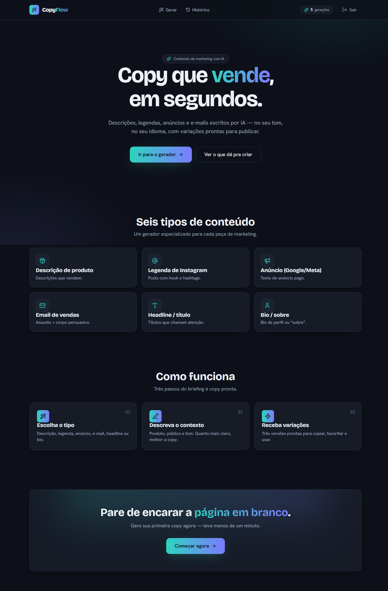
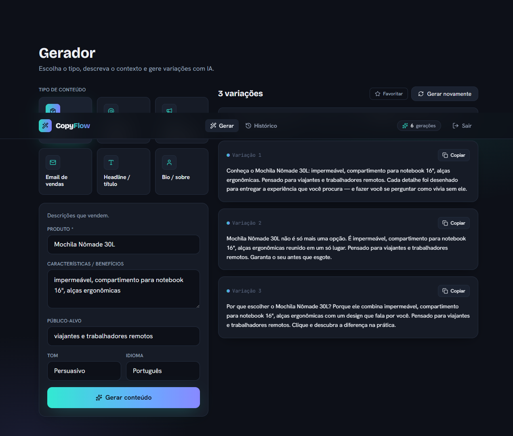
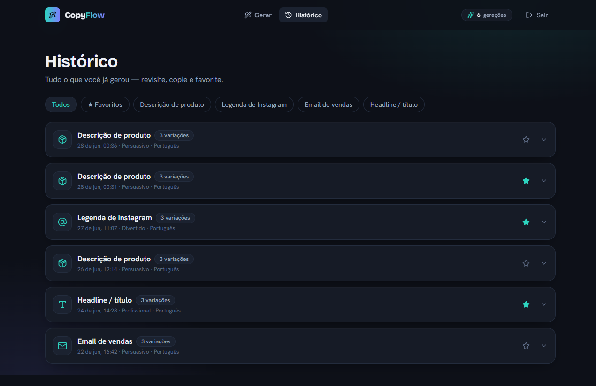
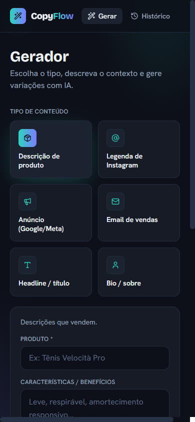

# ✦ CopyFlow — conteúdo de marketing com IA

SaaS que gera **copy de marketing com IA**: descrições de produto, legendas de
Instagram, anúncios, e-mails, headlines e bios — no **tom** e **idioma** escolhidos, com
**3 variações** prontas para copiar. Login, histórico e favoritos inclusos. Projeto de
portfólio com o detalhe que mais pesa num SaaS de IA: **a chave da API fica protegida num
back-end serverless**, nunca no front-end.

> **Demo ao vivo:** _(adicione o link da Vercel após o deploy)_
>
> Funciona **sempre-no-ar em modo demo** — sem chave de API, a função serverless devolve
> exemplos realistas montados a partir do contexto.
> **Conta de demonstração:** `dono@copyflow.com` / `copyflow123`



---

## ✨ Funcionalidades

- **Gerador com 6 tipos de conteúdo:** descrição de produto, legenda de Instagram, anúncio
  (Google/Meta), e-mail de vendas, headline e bio.
- **Formulário dinâmico** por tipo (campos diferentes) + seleção de **tom** (profissional,
  descontraído, persuasivo, divertido) e **idioma** (PT, EN, ES).
- **3 variações** por geração, com **copiar** (1 clique) e **favoritar**.
- **Histórico** completo com **filtro** (todos / favoritos / por tipo), revisitar e copiar.
- **Contador de gerações** no topo e **skeleton animado** enquanto a IA escreve.
- **Login/cadastro** (Supabase Auth) e **modo demo** (localStorage) sempre-no-ar.

| Gerador | Histórico | Mobile |
|---|---|---|
|  |  |  |

---

## 🛠 Stack

- **Front:** React 19 + Vite + Tailwind CSS v4 (tema *Mesh Aurora*)
- **Estado de servidor:** TanStack Query · **Formulários:** React Hook Form + Zod
- **IA:** **Groq** (modelo **Llama 3.3 70B**, gratuito) via **função serverless**
- **Back:** Supabase (PostgreSQL + Auth + RLS) — histórico de gerações
- **Deploy:** Vercel (`/api` como funções serverless)

## 🧠 Destaques de arquitetura

- **Chave da IA protegida no servidor.** O front **nunca** vê a `GROQ_API_KEY`. Toda
  geração passa por `POST /api/generate` — a função monta o prompt, chama a Groq e devolve
  só as variações. Em produção isso vira uma Vercel Function; no `npm run dev`, um middleware
  do Vite serve o mesmo handler de `/api`.
- **Demo sempre-no-ar com fallback.** Sem `GROQ_API_KEY` — ou se a IA atingir o limite de uso —
  a função devolve exemplos realistas montados a partir do contexto (HTTP 200, `demo: true`),
  então o link **nunca** quebra. Com a chave, gera com IA de verdade, sem mudar o front.
- **Prompt testado (TDD).** O construtor de prompt e o parser de variações têm testes
  (`vitest`): o parser lê o array JSON do modelo e tem fallback para listas numeradas.
- **Modo demo de dados.** Sem Supabase, histórico/auth rodam em localStorage (com gerações
  de exemplo já populadas). Com as variáveis, vira backend real com **RLS** (`user_id = auth.uid()`).

---

## 🚀 Rodando localmente

```bash
npm install
npm run dev      # http://localhost:5173 — já funciona em modo demo (exemplos sem IA)
npm run test     # testes do prompt/parser e da função /api (vitest)
npm run build
```

### IA real (Groq — gratuita)
1. Crie uma chave grátis em [console.groq.com](https://console.groq.com) (login com Google, sem cartão).
2. No `.env`: `GROQ_API_KEY=gsk_…` **(somente servidor — nunca prefixe com `VITE_`)**.
3. `npm run dev` — as gerações passam a usar o Llama 3.3 70B de verdade.

### Backend real (Supabase — histórico e login)
1. Crie um projeto grátis em [supabase.com](https://supabase.com).
2. No **SQL Editor**, rode `supabase/migrations/0001_schema.sql`.
3. No `.env`: `VITE_SUPABASE_URL` e `VITE_SUPABASE_ANON_KEY`.
4. Crie sua conta pela própria tela de cadastro (`/entrar`).

## 📦 Deploy (Vercel)
Importe o repositório na Vercel (Vite + funções `/api` detectadas automaticamente).
Configure as variáveis: `GROQ_API_KEY` (server), e opcionalmente
`VITE_SUPABASE_URL` / `VITE_SUPABASE_ANON_KEY`. Sem elas, a Vercel publica a demo
em modo local — sempre funcional.

---

Feito por **Leonardo Pimenta** · [github.com/leopimenta0222-dev](https://github.com/leopimenta0222-dev)
